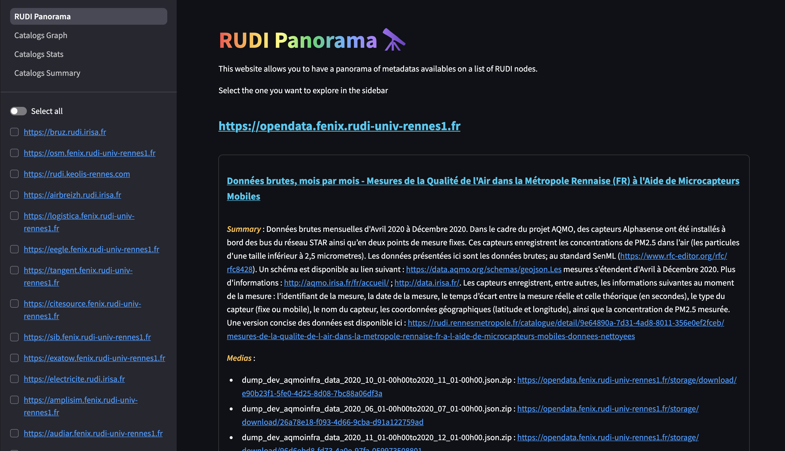
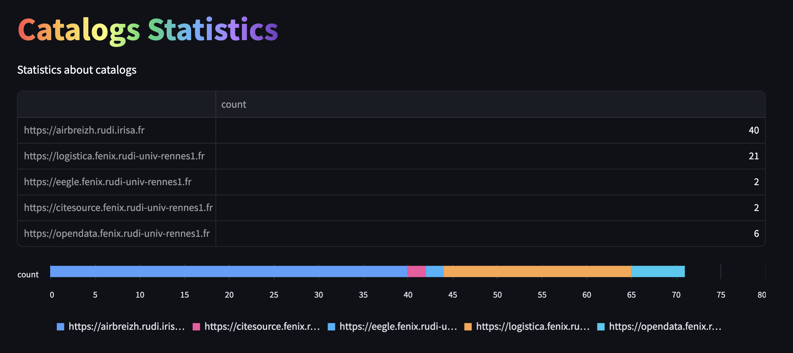
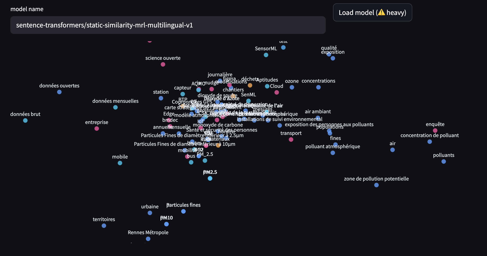

This is a light python web server based on streamlit whose aim is to easily visualize all the metadata from a list of RUDI nodes.

Since all RUDI nodes publish open-data, one can access all the (meta)data of a list of nodes. Hence, no data is stored here, we simply use the [rudi-node-read](https://github.com/OlivierMartineau/rudi-node-read) library to access all metadata catalogs of RUDI nodes.



## Catalogs statistics and graph of keywords

You can visualize basic statistics about the number of metadata on each node :



And you can load a sentence-transformer model to visualize 2D embeddings (dimensionnality reduction is made with Principal Components Analysis) of keywords accross all nodes.



## Getting started locally

You can run your own instance of the server locally simply :

__First__, git clone the project : 

```bash
git clone <url_of_project>
```

__Then__, set-up a python venv : 

```
python -m venv .venv
source .venv/bin/activate
pip install -r requirements.txt
```

After you set up a configuration file at [conf/conf.yaml](conf/conf.yaml) (see [conf/example_conf.yaml](conf/example_conf.yaml)), you can __finally__ start streamlit server :

```bash
cd src
streamlit run RUDI_Panorama.py
```

RUDI Panorama can now be accessed from http://localhost:5000 (or other port if you specify an other one in [.streamlit/config.toml](rudi-overview/.streamlit/config.toml)).

## Configuration

Specify the list of RUDI nodes in the config file ([conf/conf.yaml](conf/conf.yaml)).

Example :

```yaml
nodes_url_list:
  - https://airbreizh.rudi.irisa.fr
  - https://rm.fenix.rudi-univ-rennes1.fr
  - https://logistica.fenix.rudi-univ-rennes1.fr
```